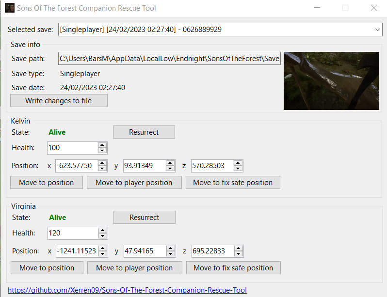
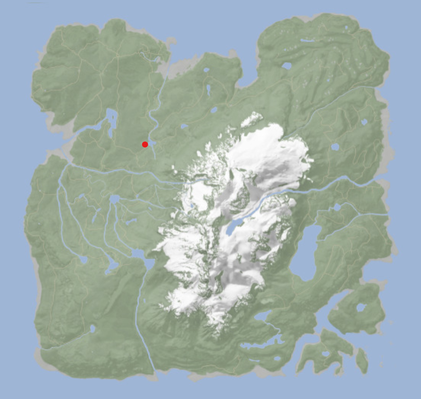

# Sons-Of-The-Forest-Companion-Rescue-Tool

A small tool that helps with reviving and unstucking your beloved Kelvin (or Virginia) when they like a wall a bit too much.

__As this tool edits your save files, always make a backup copy before committing changes to avoid issues or, in the worst case, corrupted saves. I take no responsibility for any of that, nor do I provide support to fix them.__

## Features
* __Revives:__
Both Kelvin and Virginia can be resurrected with the press of a button.
* __Move Kelvin (or Virginia):__
We've been there. You are strolling back home with some sweet treasures, only to suddenly find your beloved companion falling in love with the scenery of a nearby waterfall and refusing to leave. Now there is no need to traumatise them (and yourself) by trying to push them away with a human sized log; simply press a button, and they are free once more. It's okay. We've all been there.

## Download
Click [here](https://github.com/Xerren09/Sons-Of-The-Forest-Companion-Rescue-Tool/releases/latest) to get the latest release. This tool is compiled to be a single executable that also contains its required .NET assemblies, so after downloading there is no additional work needed to start using it!

## Usage

The tool only launches if the game is closed, this is to ensure the save files are not in use by the game, as this could corrupt them. Close the game, open the tool, make your changes and save them, then start the game back up again to load it.

Simply select the desired save from the dropdown list on the top, and all the relevant data will be loaded.

Once you are done editing, be sure to click the `Write changes to file` button, to save what was changed.

### Resurrection
Clicking this button will set the given companion's health to 100 and removes their associated player kill counters in the `SaveData.json` file. It also resets the `IsRobbyDead` or `IsVirginiaDead` flag in the `GameStateSaveData.json` file to `false`.

### Healing
The value entered here will set the companion's health. There are no known caps on these, but Kelvin's maximum natural health seems to be 100, while Virginia's is 120.

### Teleporting
__Manually setting a companion's position may result in them glitching out of the map, or stuck in an object. Be careful and back up your save before messing with this.__

Changing the values here will make the given companion to teleport to the given location. This can be particularly useful when they are stuck at a weird position, or have completely disappeared.

#### Move to position
This will move them to the given position entered the input boxes.

#### Move to player position

This will move them to the player's own position.

#### Move to fix safe position

This will move them to a very specific position I've found to be safe, and most likely nearby to most player's camps. (And totally not because it is right next to where my friends and I set up camp.) From here they should be able to path find back to you, or be picked up manually.

They will both be teleported to the red dot, marked on the map:

